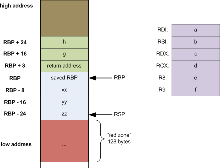

+++
title = "Registers and Memory Layout"
weight = 1
[extra]
toc = true
toc_sidebar = true
+++

## Registers (x64)

| Register | Low 32-bits | Low 16-bits | Low 8-bits | Notes                                                                       |
| -------- | ----------- | ----------- | ---------- | --------------------------------------------------------------------------- |
| `%rax`   | `%eax`      | `%ax`       | `%al`      | a function's return value, caller-saved                                     |
| `%rdi`   | `%edi`      | `%di`       | `%dil`     | 1st argument of a function, caller-saved                                    |
| `%rsi`   | `%esi`      | `%si`       | `%sil`     | 2nd argument of a function, caller-saved                                    |
| `%rdx`   | `%edx`      | `%dx`       | `%dl`      | 3rd argument of a function, caller-saved                                    |
| `%rcx`   | `%ecx`      | `%cx`       | `%cl`      | 4th argument of a function, caller-saved                                    |
| `%r8`    | `%r8d`      | `%r8w`      | `%r8b`     | 5th argument of a function, caller-saved                                    |
| `%r9`    | `%r9d`      | `%r9w`      | `%r9b`     | 6th argument of a function, caller-saved                                    |
| `%r10`   | `%r10d`     | `%r10w`     | `%r10b`    | temporary register, caller-saved                                            |
| `%r11`   | `%r11d`     | `%r11w`     | `%r11b`    | temporary register, caller-saved                                            |
| `%rbp`   | `%ebp`      | `%bp`       | `%bpl`     | base pointer, pointing to the base of the current stack frame, callee-saved |
| `%rsp`   | `%esp`      | `%sp`       | `%spl`     | stack pointer, pointing to the topmost element in the stack, callee-saved   |
| `%rbx`   | `%ebx`      | `%bx`       | `%bl`      | local variable, callee-saved                                                |
| `%r12`   | `%r12d`     | `%r12w`     | `%r12b`    | local variable, callee-saved                                                |
| `%r13`   | `%r13d`     | `%r13w`     | `%r13b`    | local variable, callee-saved                                                |
| `%r14`   | `%r14d`     | `%r14w`     | `%r14b`    | local variable, callee-saved                                                |
| `%r15`   | `%r15d`     | `%r15w`     | `%r15b`    | local variable, callee-saved                                                |
| `%rip`   |             |             |            | instruction pointer                                                         |

## Memory Layout

### Stack Frame Layout

A stack is allocated at a high address and grows towards lower addresses



### Position Independent Executables (PIE)

The memory addresses are not fully randomized, particularly the lower 3 bits of the base address, even when PIE is enabled.

```txt,linenos,hl_lines=6
pwndbg> info proc mappings
process 67443
Mapped address spaces:

Start Addr         End Addr           Size               Offset             Perms File
0x0000555555554000 0x0000555555555000 0x1000             0x0                r--p  /ptr/vuln
0x0000555555555000 0x0000555555556000 0x1000             0x1000             r-xp  /ptr/vuln
0x0000555555556000 0x0000555555557000 0x1000             0x2000             r--p  /ptr/vuln
0x0000555555557000 0x0000555555558000 0x1000             0x2000             r--p  /ptr/vuln
0x0000555555558000 0x0000555555559000 0x1000             0x3000             rw-p  /ptr/vuln
0x00007ffff7c00000 0x00007ffff7c28000 0x28000            0x0                r--p  /usr/lib/x86_64-linux-gnu/libc.so.6
0x00007ffff7c28000 0x00007ffff7db0000 0x188000           0x28000            r-xp  /usr/lib/x86_64-linux-gnu/libc.so.6
0x00007ffff7db0000 0x00007ffff7dff000 0x4f000            0x1b0000           r--p  /usr/lib/x86_64-linux-gnu/libc.so.6
0x00007ffff7dff000 0x00007ffff7e03000 0x4000             0x1fe000           r--p  /usr/lib/x86_64-linux-gnu/libc.so.6
0x00007ffff7e03000 0x00007ffff7e05000 0x2000             0x202000           rw-p  /usr/lib/x86_64-linux-gnu/libc.so.6
0x00007ffff7e05000 0x00007ffff7e12000 0xd000             0x0                rw-p
0x00007ffff7fa0000 0x00007ffff7fa3000 0x3000             0x0                rw-p
0x00007ffff7fbd000 0x00007ffff7fbf000 0x2000             0x0                rw-p
0x00007ffff7fbf000 0x00007ffff7fc1000 0x2000             0x0                r--p  [vvar]
0x00007ffff7fc1000 0x00007ffff7fc3000 0x2000             0x0                r--p  [vvar_vclock]
0x00007ffff7fc3000 0x00007ffff7fc5000 0x2000             0x0                r-xp  [vdso]
0x00007ffff7fc5000 0x00007ffff7fc6000 0x1000             0x0                r--p  /usr/lib/x86_64-linux-gnu/ld-linux-x86-64.so.2
0x00007ffff7fc6000 0x00007ffff7ff1000 0x2b000            0x1000             r-xp  /usr/lib/x86_64-linux-gnu/ld-linux-x86-64.so.2
0x00007ffff7ff1000 0x00007ffff7ffb000 0xa000             0x2c000            r--p  /usr/lib/x86_64-linux-gnu/ld-linux-x86-64.so.2
0x00007ffff7ffb000 0x00007ffff7ffd000 0x2000             0x36000            r--p  /usr/lib/x86_64-linux-gnu/ld-linux-x86-64.so.2
0x00007ffff7ffd000 0x00007ffff7fff000 0x2000             0x38000            rw-p  /usr/lib/x86_64-linux-gnu/ld-linux-x86-64.so.2
0x00007ffffffdd000 0x00007ffffffff000 0x22000            0x0                rw-p  [stack]
0xffffffffff600000 0xffffffffff601000 0x1000             0x0                --xp  [vsyscall]
```

## References

- [Stack frame layout on x86-64 - Eli Bendersky's website](https://eli.thegreenplace.net/2011/09/06/stack-frame-layout-on-x86-64)
- [x64 Cheat Sheet](https://cs.brown.edu/courses/cs033/docs/guides/x64_cheatsheet.pdf)
- [CS107 Guide to x86-64](https://web.stanford.edu/class/archive/cs/cs107/cs107.1174/guide_x86-64.html)
- [Position Independent Executables < BorderGate](https://www.bordergate.co.uk/position-independent-executables/)
